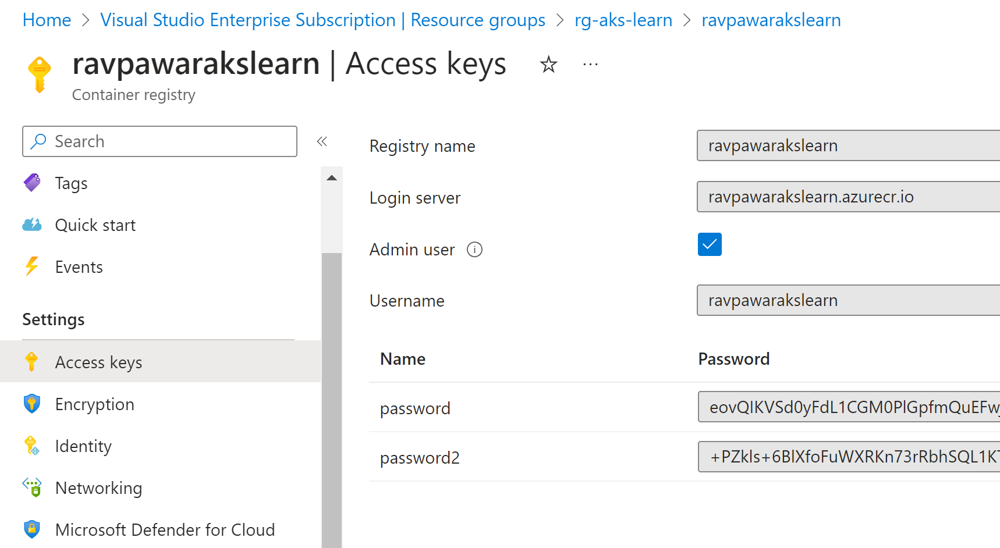

## In Azure cloud shell 
```powershell

az group create --name rg-aks-learn --location southeastasia

az aks create --resource-group rg-aks-learn --name aks-learn --node-count 3 --enable-addons monitoring --generate-ssh-keys

az aks get-credentials --resource-group rg-aks-learn --name aks-learn

kubectl get nodes

az acr create --resource-group rg-aks-learn --name ravpawarakslearn --sku Basic --admin-enabled true

```


## On local machine with docker desktop
```powershell

docker login ravpawarakslearn.azurecr.io # Username: ravpawarakslearn , Password: password

git clone https://github.com/rav-pawar/aks-learn.git

docker build -t ravpawarakslearn.azurecr.io/aks-learn:v1.0 .

docker push ravpawarakslearn.azurecr.io/aks-learn:v1.0

az acr repository list --name ravpawarakslearn --output table

```

To get username and password for Azure Container Registry



## On local machine with az cli
```powershell
az login --use-device-code

az aks get-credentials --resource-group rg-aks-learn --name aks-learn

kubectl get nodes

kubectl create secret docker-registry acr-secret \
  --docker-server=ravpawarakslearn.azurecr.io \
  --docker-username=ravpawarakslearn \
  --docker-password=password \
  --docker-email=ravpawar@hotmail.com

git clone https://github.com/rav-pawar/aks-learn.git

cd aks-learn/Deployments/

kubectl apply -f deploy.yml

kubectl delete deployment web-deploy # to abort

cd aks-learn/Services/

kubectl apply -f svc-lb.yml

```